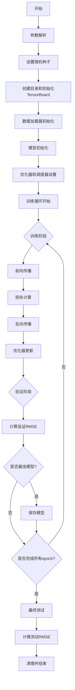

# YOTO - 主函数流程说明

## 主要功能

YOTO项目的主函数实现了轴承剩余寿命预测模型的完整训练和测试流程。该函数集成了数据加载、模型训练、验证、测试以及结果可视化等核心功能。

## 参数配置

### 模型参数
- d_model: 128 (模型维度)
- num_heads: 4 (注意力头数)
- num_layers: 2 (Transformer层数)
- num_experts: 4 (MoE专家数量)
- seed: 42 (随机种子)

### 训练参数
- batch_size: 16
- epochs: 40
- learning_rate: 5e-4
- weight_decay: 1e-4
- warmup_steps: 500

### 损失权重
- rul_weight: 1.0 (RUL损失权重)
- moe_weight: 0.01 (MoE损失权重)

### 路径配置
- data_dir: 数据目录
- save_dir: 模型保存目录
- log_dir: TensorBoard日志目录

## 执行流程

## 关键流程说明

1. **初始化阶段**
   - 解析命令行参数
   - 设置随机种子确保可重复性
   - 创建必要的目录结构
   - 初始化TensorBoard记录器

2. **数据准备**
   - 使用XJTUBearingDataModule加载数据
   - 支持通过文件名指定训练/验证/测试集
   - 实现数据归一化处理

3. **模型训练**
   - 实现完整的训练循环
   - 包含前向传播、损失计算、反向传播
   - 使用AdamW优化器
   - 实现带warmup的余弦学习率调度

4. **验证与保存**
   - 每个epoch进行验证
   - 计算验证集RMSE
   - 保存最佳模型检查点

5. **监控与可视化**
   - 使用TensorBoard记录训练过程
   - 记录损失、RMSE等指标
   - 保存超参数配置

6. **最终测试**
   - 在测试集上评估模型性能
   - 计算并输出最终RMSE指标

## 关键指标监控

- 训练损失
- 验证RMSE
- 测试RMSE
- 学习率变化
- 模型参数

## 输出文件

1. **模型检查点**
   - 保存最佳模型的权重
   - 包含优化器状态
   - 记录验证RMSE

2. **TensorBoard日志**
   - 训练过程可视化
   - 超参数记录
   - 性能指标追踪 